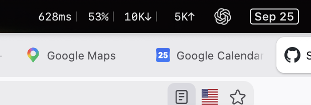

# NetMenu

[](https://github.com/SokolskyNikita/mac-net-monitor-toolbar/releases/latest)
[](LICENSE)


A lightweight macOS menu bar app that shows your live **internet latency**, **download rate**, and **upload rate** at a glance.



NetMenu is built for unreliable networks: hotels, airports, planes, and phone hotspots. It won't show a fake low ping from a captive portal or an in-flight proxy, and it shows no number at all until you're actually online.

## Features

- **Honest latency.** Pings public DNS servers and `google.com` every 3 seconds and ignores replies from the local network path.
- **Captive portal aware.** Shows `✕` instead of a number until you've passed the Wi‑Fi login page.
- **Live throughput.** Download and upload rates from the network interface counters, averaged over 5 seconds.
- **Built-in speed test.** One click runs a Cloudflare-backed test capped at about 7 MB of data.
- **Local history.** Writes a per-minute summary to a JSON Lines file you can analyze later.
- **Private by design.** No accounts, no analytics, nothing uploaded.

## Install

Requires macOS 14 (Sonoma) or later on Apple silicon or Intel.

### Homebrew (recommended)

```bash
brew tap SokolskyNikita/netmenu https://github.com/SokolskyNikita/mac-net-monitor-toolbar
brew trust sokolskynikita/netmenu
brew install --cask netmenu
```

Homebrew 7 and later only load casks from third-party taps you've trusted. If you see `Refusing to load cask ... from untrusted tap`, run the `brew trust` line once.

### Manual download

Download `NetMenu-<version>.zip` from the [latest release](https://github.com/SokolskyNikita/mac-net-monitor-toolbar/releases/latest), unzip it, and move `NetMenu.app` to `/Applications`.

### First launch

NetMenu isn't notarized by Apple yet, so macOS may block it the first time you open it. To allow it, go to **System Settings → Privacy & Security** and click **Open Anyway**, or run:

```bash
xattr -dr com.apple.quarantine /Applications/NetMenu.app
```

macOS may also ask for two permissions. Both are optional:

| Permission | Used for | If denied |
| --- | --- | --- |
| Location | Reading the Wi‑Fi network name (SSID and BSSID) | Network name is missing from the stats log |
| Local Network | Pinging your router | Router latency is missing from the stats log |

## Update and uninstall

```bash
# Update (run `brew trust sokolskynikita/netmenu` once first on Homebrew 7+)
brew update && brew upgrade --cask netmenu

# Uninstall
brew uninstall --cask netmenu
rm -rf ~/Library/Application\ Support/NetMenu   # optional: delete stats history
```

## Reading the menu bar

The menu bar shows latency, then download (`↓`) and upload (`↑`) rates.

| Latency display | Meaning |
| --- | --- |
| `24ms` | Round-trip time measured with ICMP ping |
| `~180ms` | Approximate: ping is blocked, so this is the time for an HTTPS request to Cloudflare |
| `✕` | No trustworthy reading: you're offline, behind a login page, or nothing answered in the last 60 seconds |

The number is the median of the last five measurements, so a single spike won't make it jump.

Click the icon to see peak rates for this session, run a speed test, or open the stats file.

## How latency is measured

Every 3 seconds, NetMenu runs these checks in parallel:

1. It pings `1.1.1.1`, `1.0.0.1`, `8.8.8.8`, `9.9.9.9`, and `google.com`.
2. It checks Apple's captive portal page (`captive.apple.com`), the same one macOS uses to show Wi‑Fi login screens.
3. It pings your router, when it has permission.

It then decides what to show:

- **Behind a login page:** nothing. Hotel and airport networks often answer pings and connections themselves before you log in.
- **Real ping replies arrived:** the fastest one. Replies that come from within a few network hops, or about as fast as your router, are discarded because the local network sent them, not the destination.
- **No usable ping:** the time to fetch a Cloudflare trace page over HTTPS. NetMenu checks the page contents, so a proxy can't fake the answer.
- **Nothing trustworthy:** no number. A bare TCP or TLS connection time is never shown, because in-flight and hotel proxies answer those locally in a few milliseconds.

## Stats log

Once a minute, NetMenu appends one JSON object per line to:

```text
~/Library/Application Support/NetMenu/stats.jsonl
```

Open it from the menu with **Reveal stats file**. The main fields are:

| Field | Description |
| --- | --- |
| `ts` | Timestamp (ISO 8601, UTC) |
| `type`, `network` | Connection type (`wifi`, `ethernet`, `tether`, `vpn`, `offline`) and network name |
| `lat_ms`, `lat_min`, `lat_max` | Median, minimum, and maximum latency for the minute |
| `lat_src` | How latency was measured: `icmp` or `http` (older entries may also contain `tcp` or `tls`) |
| `gw_ms` | Median router latency |
| `loss` | Fraction of probes that failed or were rejected |
| `down_Bps`, `up_Bps` | Average throughput in bytes per second |
| `rssi`, `noise`, `channel`, `tx_rate_mbps` | Wi‑Fi signal details |

Speed test results are logged as separate entries with `"event": "speedtest"`.

## Building from source

Requires the Xcode Command Line Tools (`xcode-select --install`). The full Xcode app isn't needed.

```bash
git clone https://github.com/SokolskyNikita/mac-net-monitor-toolbar.git
cd mac-net-monitor-toolbar
make run
```

| Command | What it does |
| --- | --- |
| `make run` | Build, bundle, sign ad hoc, and open `NetMenu.app` |
| `make test` | Run the unit tests in `Tests/NetMenuTests` (Swift Testing) |
| `make check` | Print a single measurement as JSON |
| `make build` | Build the universal binary only, to `build/NetMenu` |
| `make dist` | Package a release zip into `dist/` |
| `make clean` | Remove build output |

To take one measurement without the menu bar UI or any permission prompts, run:

```bash
./build/NetMenu --sample
```

### Code signing

By default, builds are signed ad hoc (`SIGN_ID=-`). macOS ties permission grants to the signature, so every rebuild asks for Location and Local Network again. To avoid that, create a stable local signing identity:

1. Open **Keychain Access → Certificate Assistant → Create a Certificate**.
2. Name it `netmenu-selfsign` and set the type to **Code Signing**.
3. Build with it:

   ```bash
   make app SIGN_ID=netmenu-selfsign && open NetMenu.app
   ```

For Developer ID signing, notarization, and publishing releases, see [RELEASING.md](RELEASING.md).

## Privacy

Everything NetMenu records stays in the stats file on your Mac. It sends only the network probes described above, plus the speed test when you start it. Location access is used only to read the Wi‑Fi network name, and Local Network access only to ping your router.

## License

NetMenu is released under the [MIT License](LICENSE).
