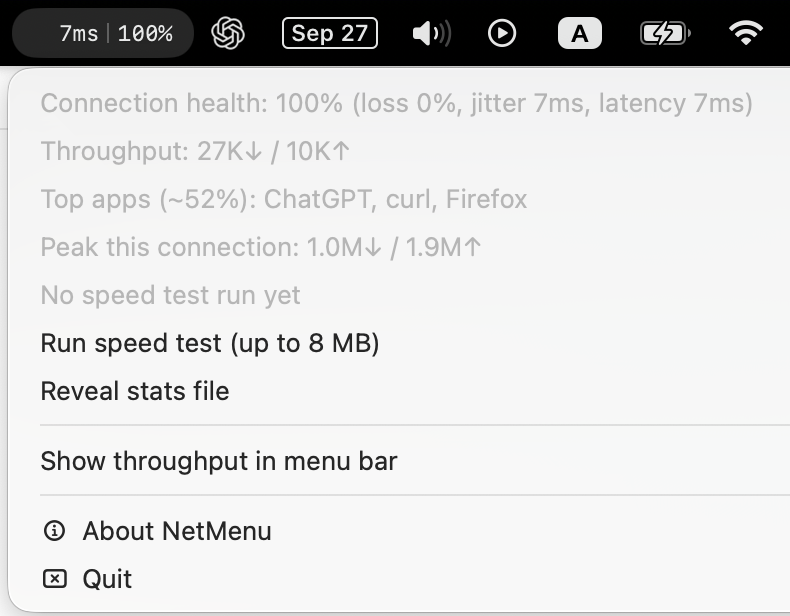

# NetMenu

[](https://github.com/SokolskyNikita/mac-net-monitor-toolbar/releases/latest)
[](LICENSE)


A macOS menu bar app that shows live internet latency, connection health, throughput and top bandwidth users, with a speed test and a per-minute history log.

NetMenu is built for unreliable networks such as hotels, airports, planes and phone hotspots. It discards fake low pings answered by captive portals and in-flight proxies. It also checks that ordinary websites load, since ping can work while web access is blocked. There are no accounts or analytics; apart from its probes and the speed tests you start, nothing leaves your Mac.



## Install

Requires macOS 14 (Sonoma) or later on Apple silicon or Intel.

### Homebrew (recommended)

```bash
brew tap SokolskyNikita/netmenu https://github.com/SokolskyNikita/mac-net-monitor-toolbar
brew trust sokolskynikita/netmenu
brew install --cask netmenu
```

The `brew trust` line is required on Homebrew 7 and later, which refuse casks from untrusted third-party taps (`Refusing to load cask ... from untrusted tap`). If you installed NetMenu on an older Homebrew, run that line once before your next upgrade.

```bash
brew update && brew upgrade --cask netmenu      # update
brew uninstall --cask netmenu                   # uninstall
rm -rf ~/Library/Application\ Support/NetMenu   # optional: delete stats history
```

### Manual download

Download `NetMenu-<version>.zip` from the [latest release](https://github.com/SokolskyNikita/mac-net-monitor-toolbar/releases/latest), unzip it and move `NetMenu.app` to `/Applications`.

### First launch

NetMenu isn't notarized yet, so macOS may block it the first time you open it. Click **Open Anyway** in **System Settings → Privacy & Security**, or run:

```bash
xattr -dr com.apple.quarantine /Applications/NetMenu.app
```

macOS may also ask for two optional permissions:

| Permission | Used only for | If denied |
| --- | --- | --- |
| Location | Reading the Wi‑Fi network name (SSID and BSSID) | Network name is missing from the stats log |
| Local Network | Pinging your router | Router latency is missing from the stats log |

## Reading the menu bar

The menu bar shows latency and connection health. Download (`↓`) and upload (`↑`) rates come from the network interface counters, averaged over 5 seconds. They appear in the menu alongside their peaks and the health breakdown; turn on **Show throughput in menu bar** to put them next to the health too. **Peak this connection** resets on every network change, including a switch to another Wi‑Fi network or access point.

### Top apps

The **Top apps** row updates at most once every **10 seconds**, ranking apps by all their downloaded and uploaded bytes over the preceding 10-second sampling window. It lists the largest contributors until their combined share reaches **80%**, capped at **three apps**. If three fall short, it shows their actual approximate share, such as `Top apps (~64%): Firefox, Dropbox, Spotify`. Long names are shortened to fit.

NetMenu reads macOS's built-in `nettop` counters for TCP and UDP traffic on Wi-Fi and wired interfaces, including local network traffic but excluding loopback. Helpers inside the same app bundle are grouped together. Entries with the same display name, such as multiple `curl` processes, are then combined before ranking, regardless of their process IDs or executable paths. Traffic from the `ping` and `curl` helpers NetMenu runs for its own probes counts as NetMenu, not as `curl`. This needs no administrator access or new permission in a normal app launch. App names stay on your Mac and aren't added to the stats log.

Shares are approximate because socket and interface counters differ. Unattributed interface traffic stays in the total; if app counters exceed that total, their sum is used instead. If interface counters are temporarily missing, the app counters supply the total. VPNs, proxies and shared services may appear as the traffic owner.

Temporary sampling failures and network changes keep the previous list visible for about a minute, labelled **last sample**, while collection retries. **Unavailable** appears only after three failed initial readings or a minute without a valid sample, on the next display update. A valid idle reading shows **no traffic**. One malformed process row doesn't discard other usable rows. Retry and recovery labels follow the same 10-second display cadence.

### Latency

Every 3 seconds, NetMenu runs these probes in parallel:

- ICMP pings to `1.1.1.1`, `1.0.0.1`, `8.8.8.8`, `9.9.9.9` and `google.com`
- A ping to your router, if Local Network access is granted
- A fetch of Apple's captive portal check (`captive.apple.com`), the page macOS uses to detect Wi‑Fi login screens, and the two website fetches used for [connection health](#connection-health). While everything answers, these run every fifth cycle (every 15 seconds) to save energy. They run every cycle after any lost or failed probe, a failed website check, a login page or a network change.

| Display | Meaning |
| --- | --- |
| `24ms` | Fastest ICMP ping reply. Replies from within a few network hops, or about as fast as your router, are discarded because the local network sent them. |
| `~180ms` | Ping is blocked, so this is the time to fetch a Cloudflare trace page over HTTPS. The page contents are verified, which stops a proxy from faking the answer. Not used while a login page is detected. |
| `✕` | Neither ping nor the HTTPS fallback gave a trustworthy answer in the last 60 seconds. Bare TCP or TLS connection times are never shown, because hotel and in-flight proxies answer those locally in a few milliseconds. |

The displayed number is the median of the last five readings, so a single spike won't move it.

### Connection health

The percentage next to the latency first checks that ordinary websites load. NetMenu fetches `https://example.com/` and `https://www.google.com/robots.txt` in parallel, bypassing caches, with an 8-second timeout, on the schedule described under [Latency](#latency). At least one must return a successful HTTPS response with the expected content. Redirects, login pages, DNS resolution and TCP/TLS handshakes don't count. Nor can a working Apple captive check or Cloudflare trace stand in, since a network can allowlist those while blocking everything else.

If both sites fail, health drops to **0%**, whatever the latency shows, and the menu reports **internet sites unreachable**. This happens as soon as the cycle completes if nothing else got through either (no ping reply and no HTTPS fallback) or a login page was detected. If pings still work, NetMenu waits for a second failing cycle, a few seconds later, so one dropped request can't zero a working connection. Meanwhile the menu notes **websites failed, rechecking**.

When websites load, health scores the last minute of probes. The score is averaged over 10 seconds and changes at most once every 10 seconds. A spinner stands in for it during the first three probe cycles while it calibrates. A confirmed outage skips calibration and smoothing. After a verified recovery, normal scoring resumes without averaging in the forced 0%.

Health only judges the network on measurements NetMenu actually made. A probe this Mac couldn't run, such as a helper that failed to start or a ping target whose name didn't resolve, is left out rather than counted as lost. After waking from sleep or switching networks, failures are ignored until something answers, for at most 30 seconds, so the moments Wi‑Fi takes to reconnect don't depress the score for the next minute.

A connection within Zoom's [recommended limits](https://support.zoom.com/hc/en/article?id=zm_kb&sysparm_article=KB0070504) for HD video (latency up to 150ms, jitter up to 40ms, packet loss up to 2%) scores 100%. Past those limits three penalties multiply, so one bad factor is enough to pull the score down:

| Factor | Measured as | Example effect |
| --- | --- | --- |
| Packet loss | Share of pings lost, counting only targets that answered at least once in the window. A target losing more than 10 points more than the others is left out, keeping a majority of targets, so one server rate-limiting pings doesn't read as a bad connection. Loss affecting every target counts in full. When every ping is blocked and NetMenu falls back to HTTPS, a probe cycle with no answer counts as lost. | 5% loss costs about 32% and 10% about 67% |
| Jitter | Average change between consecutive replies from the same target, ignoring the largest 10%, divided by `max(1, median latency / 200ms)`. The fastest target changing from one cycle to the next isn't jitter. | Alternating 15ms/100ms costs about 60%. Alternating 600ms/700ms or a single spike costs nothing. |
| Latency | Median latency | 300ms costs about 11% and 600ms about 44%. The cost never exceeds 70%. |

On links with a median latency under 200ms the jitter scaling does nothing. Above that, swings of up to 20% of median latency are free and the penalty ramp stretches to match. The menu still reports raw jitter in milliseconds.

## Speed test

Start it from the menu, and choose **Cancel speed test** to stop it early. It measures download and upload against Cloudflare (`speed.cloudflare.com`). It's built to be accurate on anything from a satellite link to gigabit fiber while using as little data as it can:

- **Parallel connections.** Four connections run at once, because a single connection often can't fill a fast or lossy link.
- **Adaptive requests.** Requests start at 64 KB and double until each takes about 0.75 seconds at the measured rate (longer on high-latency links).
- **Measured after ramp-up.** Throughput is the total bytes all connections moved per second, after the first second of ramp-up. Upload bytes count only once the server has confirmed receiving them.
- **Stops early.** Each direction stops as soon as throughput holds steady (within 10% for two seconds), or after 12 seconds.
- **Latency.** The menu shows idle latency, and latency under load, which reveals bufferbloat: how much a busy connection slows everything else on it.

| Data use | Budget |
| --- | --- |
| Normal | 32 MB: up to 20 MB download, the rest (at least 12 MB) upload |
| Very fast links (at least 150 Mbps when a direction hits its limit) | Grows once per direction, to 40 MB download and 64 MB in total |
| Low Data Mode or a metered network such as an iPhone hotspot | 8 MB, never grows |

Every request reserves its full size from the budget before it starts, so payload never exceeds the budget. HTTP and TLS overhead adds about 1–3%. If a direction runs out of data while throughput is still climbing, its result is a lower bound and shows with `≥`, for example **≥480↓**.

The menu shows a result like **Last test: 268↓ / 41↑ Mbps · 9ms, 38ms loaded**. The [diagnostic log](#diagnostic-log) records the full breakdown: connections, data used, timing and any errors per direction. If one direction fails, the other's result is kept as a **Partial test** and the menu names the failure, such as **upload: timed out**. A network change stops the test. While the test runs, connection health ignores its own probes, since the test saturates the link on purpose. Failed or partial tests can be retried after 15 seconds, successful ones after 60.

To run the same test from a terminal:

```bash
NetMenu.app/Contents/MacOS/NetMenu --speedtest
```

Add `--low-data` to use the 8 MB budget.

## Stats log

Once a minute, NetMenu appends a JSON line to `~/Library/Application Support/NetMenu/stats.jsonl`, which you can open with **Reveal stats file** in the menu. The file is capped at 100 MB. When an append would exceed that, the oldest entries are dropped to keep roughly the newest 90 MB; oversized files are also trimmed at launch.

Each per-minute entry includes:

| Field | Description |
| --- | --- |
| `ts` | Timestamp (ISO 8601, UTC) |
| `type`, `network` | Connection type (`wifi`, `ethernet`, `tether`, `vpn`, `offline`) and network name |
| `lat_ms`, `lat_min`, `lat_max` | Median, minimum and maximum latency for the minute |
| `lat_src` | How latency was measured: `icmp` or `http` (older entries may also contain `tcp` or `tls`) |
| `gw_ms` | Median router latency |
| `loss` | Fraction of pings that failed or were rejected, between 0 and 1. Pings that couldn't run are left out. |
| `health` | Health score (0–100) at the end of the minute, or `null` without enough fresh data; 0 during a confirmed outage |
| `internet_reachable` | Whether at least one website passed in the latest probe cycle that could check them |
| `internet_checks` | Latest per-site results for `example.com` and `www.google.com`; a site whose check couldn't run is omitted |
| `captive` | Whether Apple's captive check detected a login page in the latest cycle |
| `down_Bps`, `up_Bps` | Average throughput in bytes per second |
| `rssi`, `noise`, `channel`, `tx_rate_mbps` | Wi‑Fi signal details |

Each speed test, including failed and cancelled ones, adds a separate entry with `"event": "speedtest"`:

| Field | Description |
| --- | --- |
| `status` | `ok`, `partial`, `failed` or `cancelled` |
| `down_mbps`, `up_mbps` | Result, or `null` when a direction has no result |
| `down_lower_bound`, `up_lower_bound` | `true` when the result is a lower bound (shown with `≥`) |
| `down_stable`, `up_stable` | Whether throughput settled before the test stopped |
| `idle_latency_ms`, `down_loaded_latency_ms`, `up_loaded_latency_ms` | Latency before the test and under load |
| `down_bytes`, `up_bytes`, `down_streams`, `up_streams` | Payload moved and connections used per direction |
| `bytes_reserved`, `budget_bytes`, `low_data` | Data reserved across all requests, the budget that applied, and whether Low Data Mode limits were used |
| `errors`, `duration_s`, `server` | Per-direction errors, total time, and the test server |

## Diagnostic log

For troubleshooting, NetMenu also keeps a detailed plain-text log in `~/Library/Logs/NetMenu/NetMenu.log`. Open it with **Reveal diagnostic log** in the menu, or in Console.app under Log Reports. It records:

- Every probe cycle: each ping target's reply time and hop count, or `lost` / `unmeasured(reason)`; each website check's result, curl error and duration; the captive check; router latency; and what was published
- Every visible health change, with loss, jitter and latency
- Network changes, sleep and wake, speed tests, and helper failures
- A heartbeat every 5 minutes with the app's open files, threads, memory and failure counters

The log rotates at 10 MB and keeps two older files (`NetMenu.1.log`, `NetMenu.2.log`), so it never exceeds 30 MB. That's about three days of history. Warnings and errors also go to the macOS unified log:

```bash
log show --last 1d --predicate 'subsystem == "me.sokolsky.netmenu"'
```

As a last resort, NetMenu restarts itself if, after at least 30 minutes running, it finds it is leaking resources (open files, threads or memory) or its main thread has hung for 2 minutes. The log records why.

## Building from source

Requires the Xcode Command Line Tools (`xcode-select --install`), not the full Xcode app.

```bash
git clone https://github.com/SokolskyNikita/mac-net-monitor-toolbar.git
cd mac-net-monitor-toolbar
make run
```

| Command | What it does |
| --- | --- |
| `make build` | Build the universal binary to `build/NetMenu` |
| `make app` | Build, bundle and sign `NetMenu.app` (ad hoc unless `SIGN_ID` is set) |
| `make run` | `make app`, then open it |
| `make test` | Run the unit tests |
| `make check` | Print one measurement as JSON via `./build/NetMenu --sample`, without the menu bar UI or permission prompts |
| `make dist` | Package a release zip into `dist/` |
| `make clean` | Remove build output |

### Project layout

```text
Sources/NetMenu/
  App/          App lifecycle and entry point
  Monitoring/   Bandwidth, latency, health, network identity and speed tests
  Support/      Shared constants, process helpers, stats and diagnostic logs, watchdog
  UI/           Menu bar rendering
Resources/      App metadata and icon
Tests/          Swift Testing suites
docs/           Release guide and screenshots
scripts/        Icon generation and Homebrew release helpers
Casks/          Homebrew cask
```

The Makefile and Swift package pick up any Swift file under `Sources/NetMenu/` automatically.

### Code signing

Builds are signed ad hoc by default (`SIGN_ID=-`). macOS ties permission grants to the signature, so every rebuild asks for Location and Local Network again. A stable local signing identity fixes that:

1. Open **Keychain Access → Certificate Assistant → Create a Certificate**.
2. Name it `netmenu-selfsign` and set the type to **Code Signing**.
3. Build with `make run SIGN_ID=netmenu-selfsign`.

For Developer ID signing, notarization and releases, see the [release guide](docs/RELEASING.md).

## License

NetMenu is released under the [MIT License](LICENSE).
